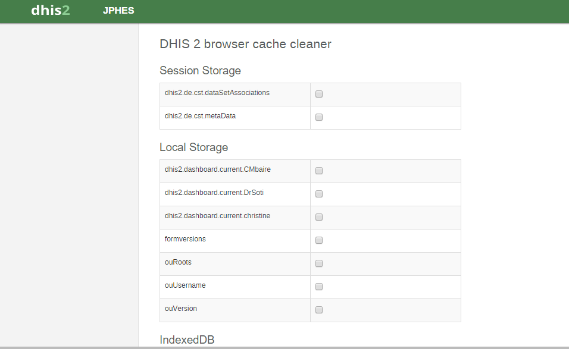

Clearing Cache
==============
During periods of customizing PHES you will often do a lot of changes to forms and reports. As a result, sometimes the content stored locally in your web browser is not updated accordingly and there is a need to clear your browser cache.
PHES heavily utilizes the offline storage features, enabling you for instance to capture data even while being disconnected from the Internet. However, most browsers do not clear the offline content (local storage, indexed database) by default when clearing the cache. There several ways by which you can clear your browser cache. The simplest way to clear cache on your browser is pressing the combination of keys <Ctrl><Shift><Delete> on the keyboard.
Another way is by using PHES’s browser cache cleaner app, which can be accessed from Apps->More Apps->Browser Cache Cleaner.
This displays a page with several options as below;

Select whatever you want cleared and click on Clear button.

For Chrome browser users, another  way is by using an app found in Chrome Web Store as follows

* Install the app from `here <https://chrome.google.com/webstore/detail/clear-cache/cppjkneekbjaeellbfkmgnhonkkjfpdn>`_
* An icon will be added to the top right corner. Right-click it and select "Options".
* Under "Data to remove" select everything except "Cookies".
* Under "Time period" select "Everything", and close the browser tab.
* Click the Clear cache icon in the top-right corner.

All cached data, including offline content, will now be cleared, and you will get a fresh view of the system.

