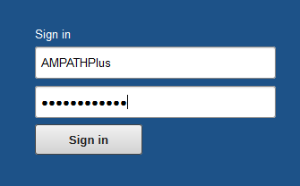
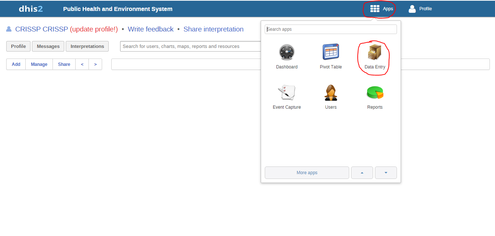
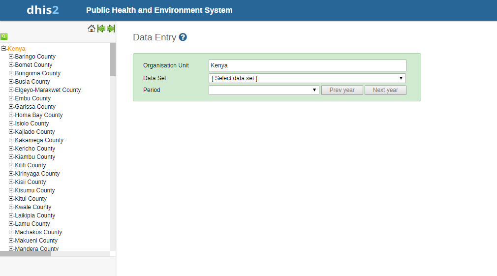
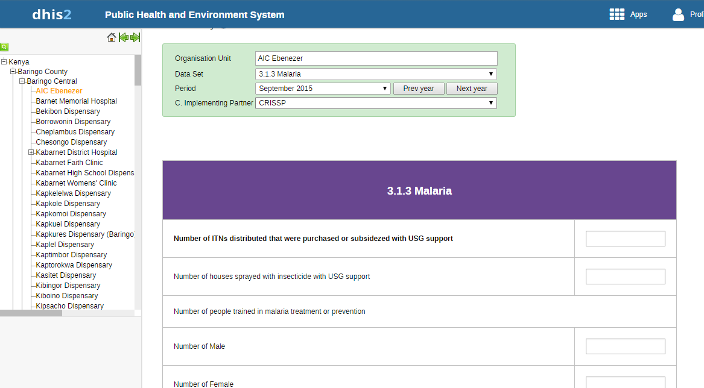
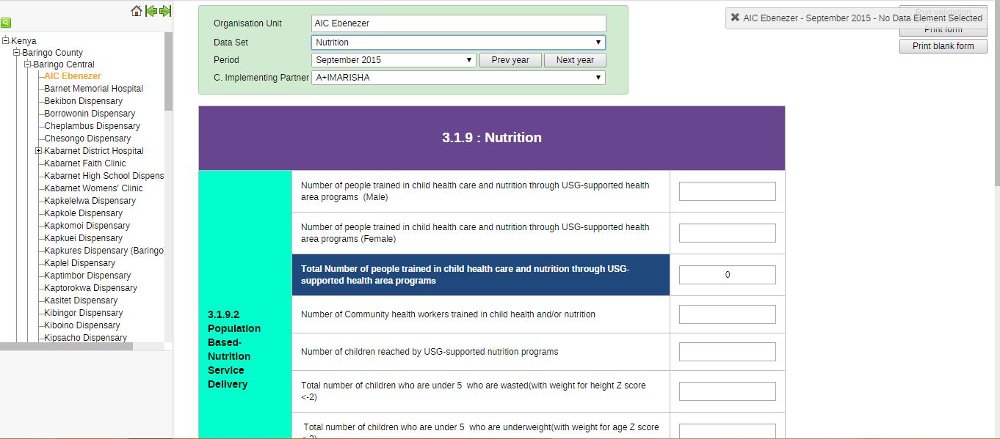
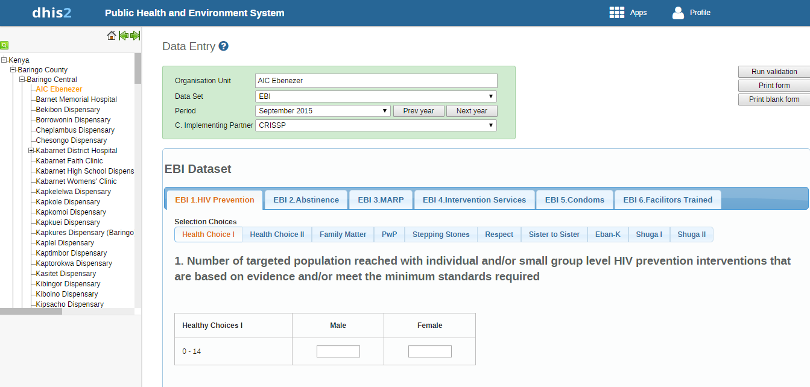
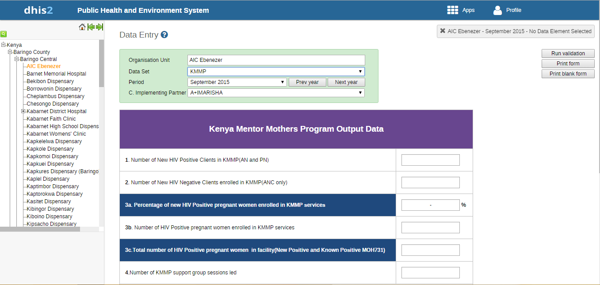
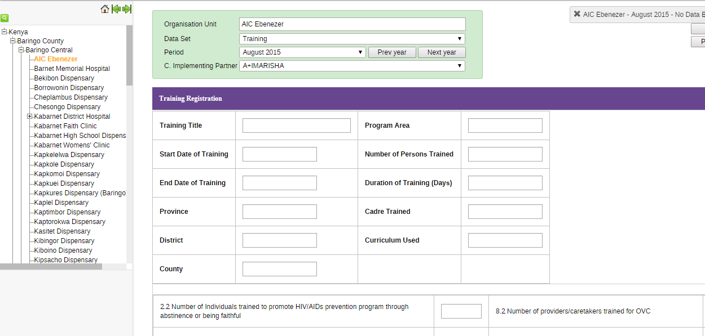
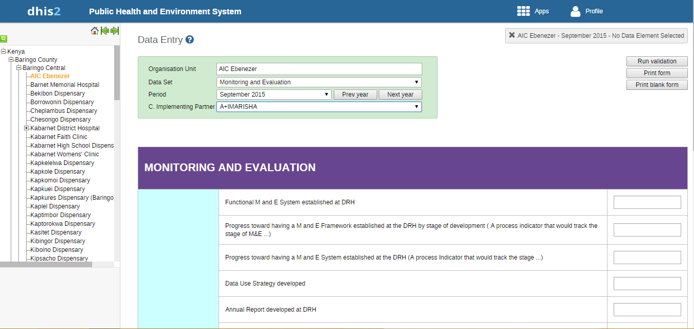
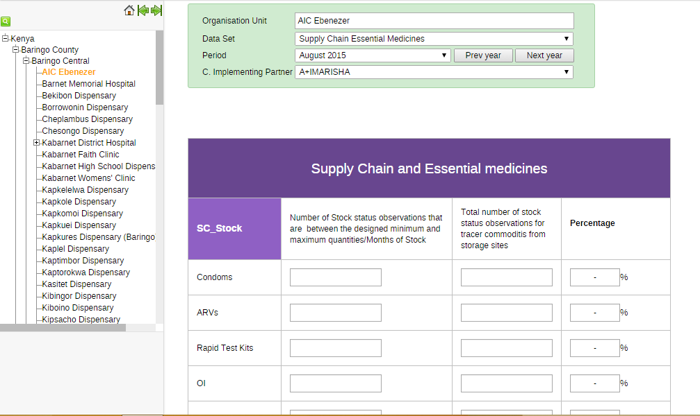

Getting Started
===============

System Log in
-------------
You are required to provide your username and password in order to access the system.
Figure 1 below is a screenshot of the start page/login page .Once logged in, the user can see their dashboard
because this is the default landing page.

Data Entry
----------
The PHES data entry module is designed in such a way that an Implementing Partner can only enter their data. PHES datasets were migrated
from KePMS, retaining dataset names and look and feel as were in KePMS. After logging into the system, hover mouse pointer/click on the
*Apps* icon on the far left as shown on the figure below. On the dropdown that appears, click on *Data Entry* icon.

This navigates to the data entry page, as shown on the figure below. For data entry forms to appear, you will be required to first select an
organization unit/facility you are reporting for on the left panel, the dataset, reporting period and the implementing partner you are
reporting for, which comes up after selecting the *organization unit*, *Dataset* and *period* that the user is reporting for.

Data Entry Forms
----------------
Below are sample screenshots for different data entry forms;

Malaria
~~~~~~~

Nutrition
~~~~~~~~~

EBI
~~~~

KMMP
~~~~

Training
~~~~~~~~

Monitoring and Evaluation
~~~~~~~~~~~~~~~~~~~~~~~~~

Supply Chain Essential Medicines
~~~~~~~~~~~~~~~~~~~~~~~~~~~~~~~~

.. _a screencast: https://www.youtube.com/watch?feature=player_embedded&v=oJsUvBQyHBs
.. _Python: https://www.python.org/
.. _Sphinx: http://sphinx-doc.org/
.. _Markdown: http://daringfireball.net/projects/markdown/syntax
.. _Mkdocs: http://www.mkdocs.org/
.. _install Sphinx: http://sphinx-doc.org/latest/install.html
.. _install Mkdocs: http://www.mkdocs.org/#installation
.. _reStructuredText: http://sphinx-doc.org/rest.html
.. _this template: http://docs.writethedocs.org/en/latest/writing/beginners-guide-to-docs/#id1
.. _Sign up: http://readthedocs.org/accounts/signup
.. _log in: http://readthedocs.org/accounts/login
.. _dashboard: http://readthedocs.org/dashboard
.. _Import: http://readthedocs.org/dashboard/import
.. _Post Commit Hooks: http://readthedocs.org/docs/read-the-docs/en/latest/webhooks.html