Data Entry
==========
The PHES data entry module is designed in such a way that an Implementing Partner can only enter their data. PHES datasets were migrated
from KePMS, retaining dataset names and look and feel as were in KePMS. After logging into the system, hover mouse pointer/click on the
*Apps* icon on the far left as shown on the figure below. On the dropdown that appears, click on *Data Entry* icon.

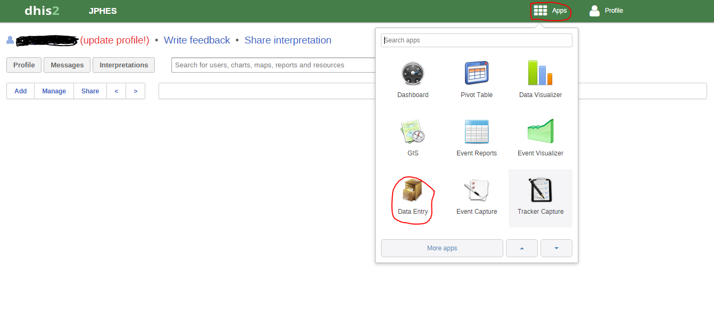

This navigates to the data entry page, as shown on the figure below. For data entry forms to appear, you will be required to first select an
organization unit/facility you are reporting for on the left panel, the dataset, reporting period and the implementing partner you are
reporting for, which comes up after selecting the *organization unit*, *Dataset* and *period* that the user is reporting for.

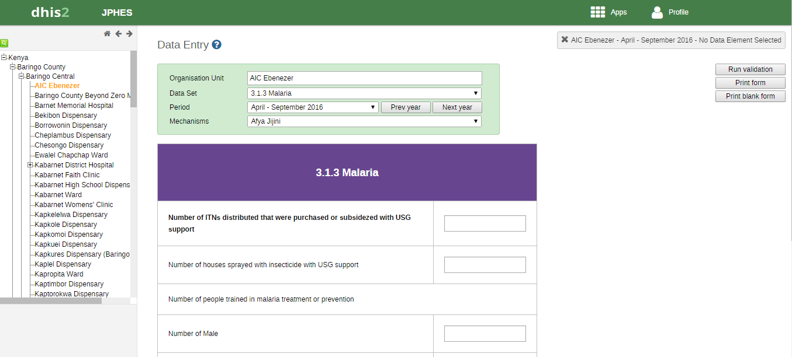

Data Entry Forms
----------------
Below are sample screenshots for different data entry forms;

Facility Level
--------------
Facility level datasets include Malaria, Family Planning and Reproductive Health Performance,
Maternal and Child Health Performance and Nutrition Performance.

Malaria
~~~~~~~
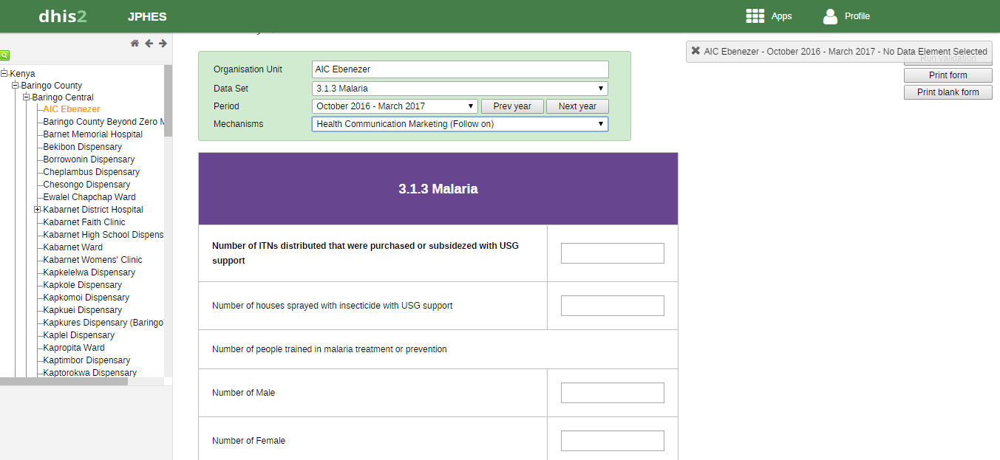

Family Planning and Reproductive Health
~~~~~~~~~~~~~~~~~~~~~~~~~~~~~~~~~~~~~~~
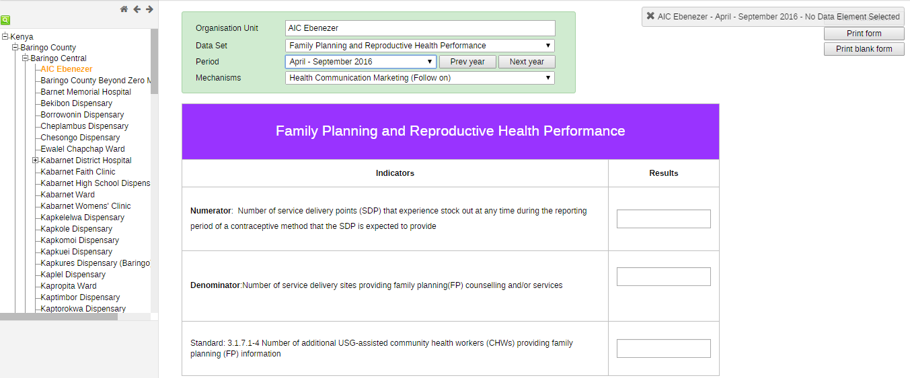

Maternal and Child Health Performance
~~~~~~~~~~~~~~~~~~~~~~~~~~~~~~~~~~~~~
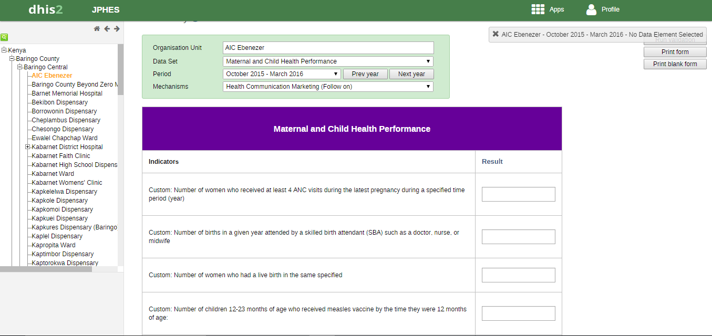

Nutrition Performance
~~~~~~~~~~~~~~~~~~~~~
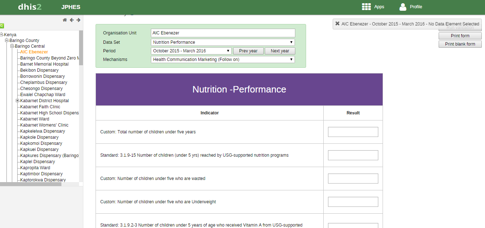

County Level
------------
County Performance
~~~~~~~~~~~~~~~~~~
It is a composite dataset combining several individual sub-datasets as including Nutrition,
MCH, FP_RH and Malaria implemented as tabs on one form, as shown on the figure below

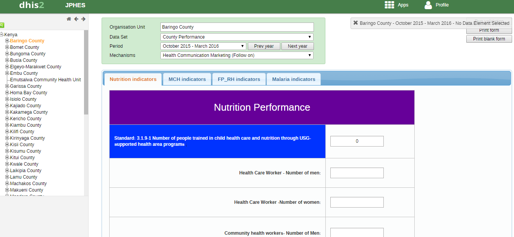

Family Planning and Reproductive Health Narrative
~~~~~~~~~~~~~~~~~~~~~~~~~~~~~~~~~~~~~~~~~~~~~~~~~
Used to enter narrative data for FPRH

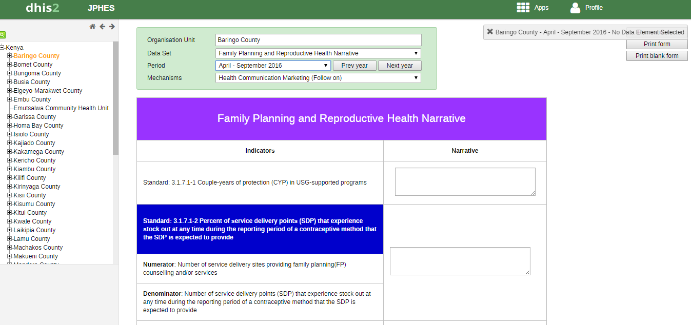

Family Planning and Reproductive Health Target
~~~~~~~~~~~~~~~~~~~~~~~~~~~~~~~~~~~~~~~~~~~~~~
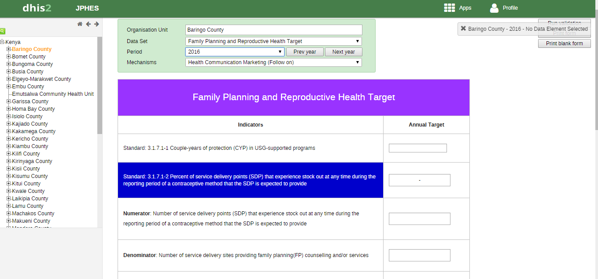

Malaria Narrative
~~~~~~~~~~~~~~~~~
Used to enter narrative data for Malaria
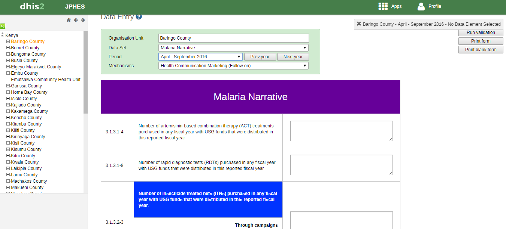

Malaria Target
~~~~~~~~~~~~~~
Used to enter target data for Malaria
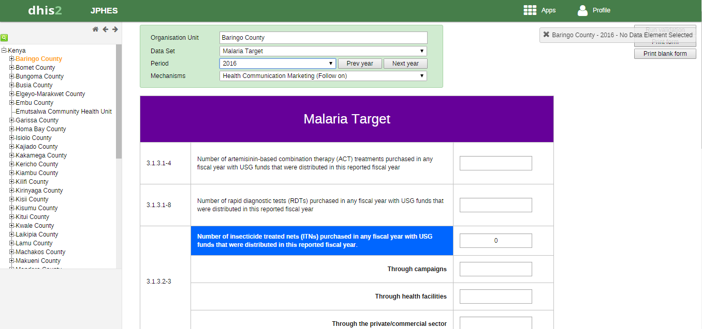

Maternal and Child Health Narrative
~~~~~~~~~~~~~~~~~~~~~~~~~~~~~~~~~~~
Used to enter MCH narrative data.
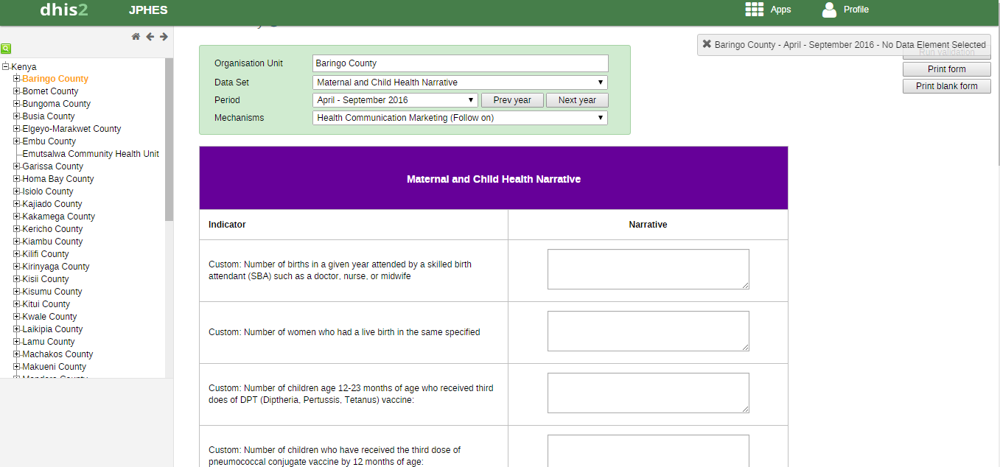

Maternal and Child Health Target
~~~~~~~~~~~~~~~~~~~~~~~~~~~~~~~~~~~
Used to enter MCH target data.
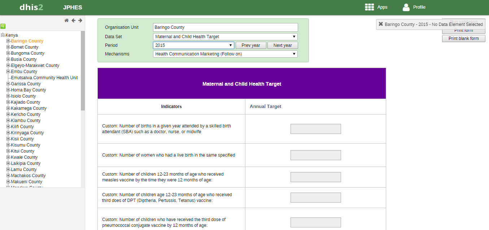

Nutrition Narrative
~~~~~~~~~~~~~~~~~~~~~~~~~~~~~~~~~~~
Used to enter Nutrition narrative data.
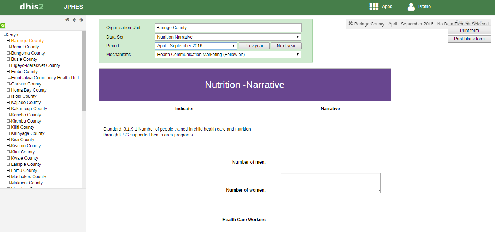

Nutrition Target
~~~~~~~~~~~~~~~~~~~~~~~~~~~~~~~~~~~
Used to enter Nutrition target data.
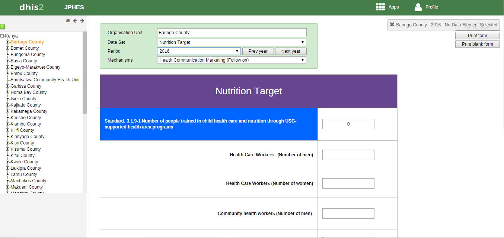

Training
~~~~~~~~
Holds data for training dataset
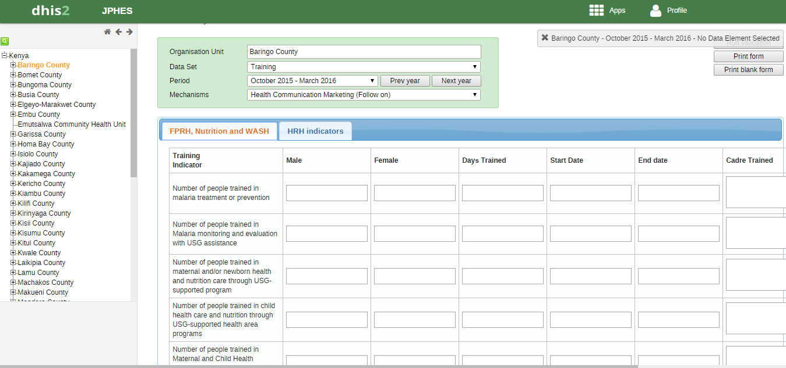

WASH Narrative
~~~~~~~~~~~~~~
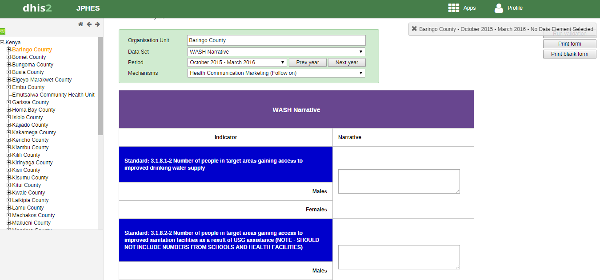

WASH Target
~~~~~~~~~~~
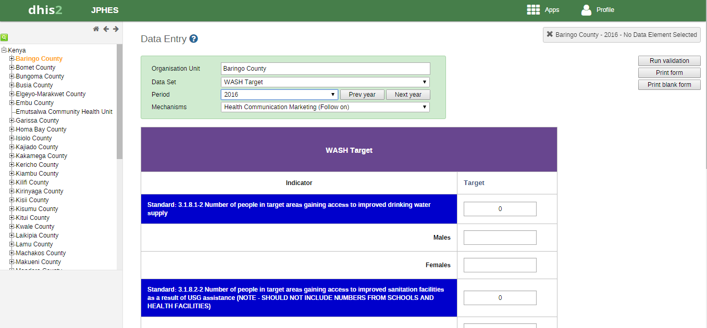

.. _a screencast: https://www.youtube.com/watch?feature=player_embedded&v=oJsUvBQyHBs
.. _Python: https://www.python.org/
.. _Sphinx: http://sphinx-doc.org/
.. _Markdown: http://daringfireball.net/projects/markdown/syntax
.. _Mkdocs: http://www.mkdocs.org/
.. _install Sphinx: http://sphinx-doc.org/latest/install.html
.. _install Mkdocs: http://www.mkdocs.org/#installation
.. _reStructuredText: http://sphinx-doc.org/rest.html
.. _this template: http://docs.writethedocs.org/en/latest/writing/beginners-guide-to-docs/#id1
.. _Sign up: http://readthedocs.org/accounts/signup
.. _log in: http://readthedocs.org/accounts/login
.. _dashboard: http://readthedocs.org/dashboard
.. _Import: http://readthedocs.org/dashboard/import
.. _Post Commit Hooks: http://readthedocs.org/docs/read-the-docs/en/latest/webhooks.html