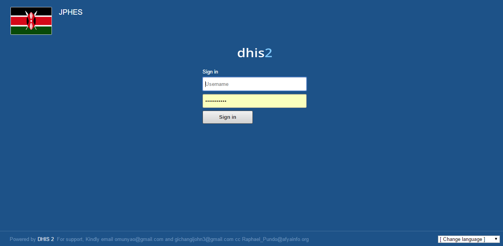
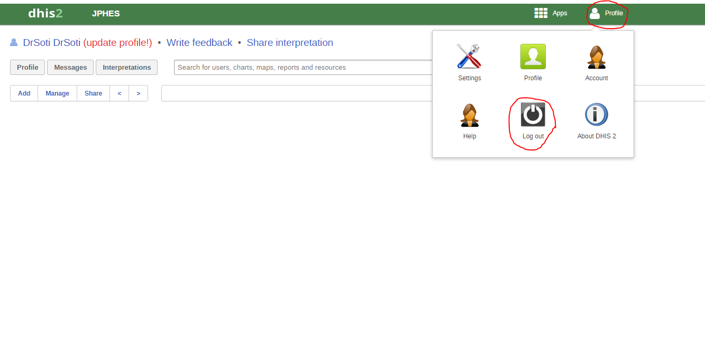

Getting Started
===============

System Log in
-------------
You are required to provide your username and password in order to access the system.
Figure 1 below is a screenshot of the start page/login page .Once logged in, the user can see their dashboard
because this is the default landing page.

System Log Out
On the far right of the top bar on the system, there is **Profile** menu. When you hover your mouse pointer on the menu,
 a drop down appears that has a log out button. Click on the button to signout. Below is a screenshot of the same:

